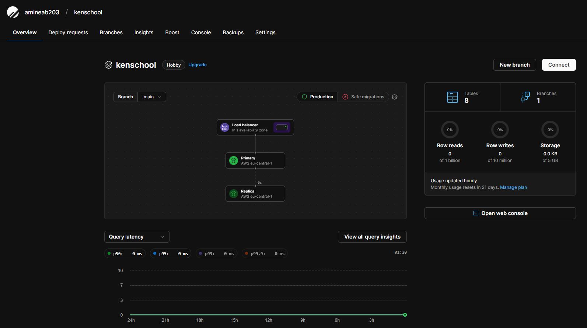

## Getting Started

First, run the development server:

```bash
npm run dev

```

Key Features:

- Browse & Filter Courses
- Purchase Courses using Stripe
- Mark Chapters as Completed or Uncompleted
- Progress Calculation of each Course
- Student Dashboard
- Teacher mode
- Create new Courses
- Create new Chapters
- Easily reorder chapter position with drag n’ drop
- Upload thumbnails, attachments and videos using UploadThing
- Video processing using Mux
- HLS Video player using Mux
- Rich text editor for chapter description
- Authentication using Clerk
- ORM using Prisma
- MySQL database using Planetscale

## database

https://planetscale.com/


## commands

```bash
npx shadcn-ui@latest add sheet
npm install @radix-ui/react-dropdown-menu
npm install @radix-ui/react-slot
npx shadcn-ui@latest add Button
npx shadcn-ui@latest add dropdown-menu
npx prisma init
npm i next-themes
npx shadcn-ui@latest init
npx shadcn-ui@latest add form
npx shadcn-ui@latest add input
npx shadcn-ui@latest add textarea
npm i axios
npm i react-hot-toast
npm i @prisma/client

# run this after adding the prisma schema
npx prisma generate
npx prisma db push //to push to planetscale

# to see data with prisma
npx prisma studio
```
